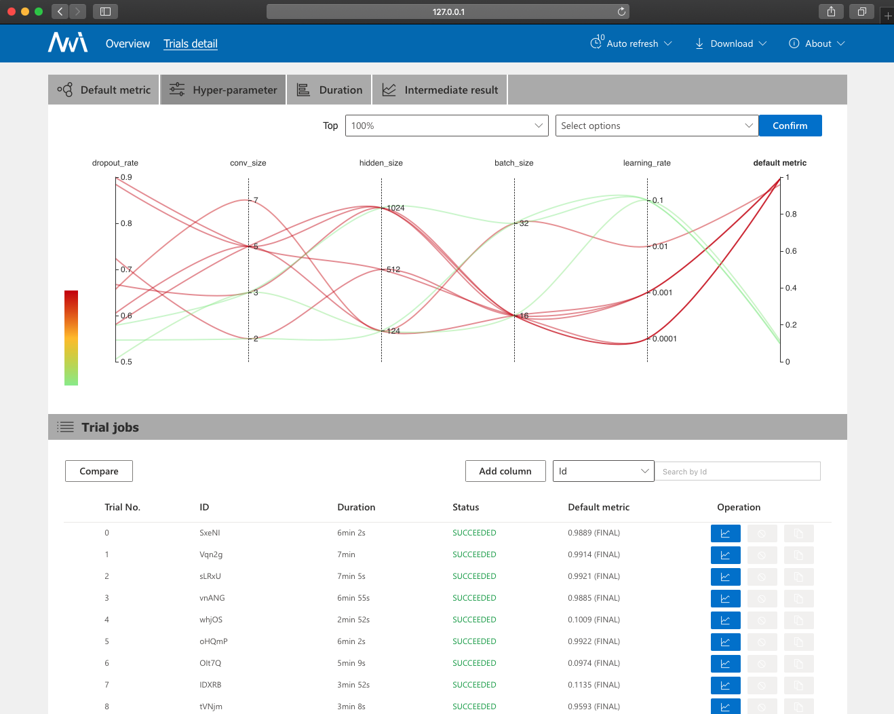
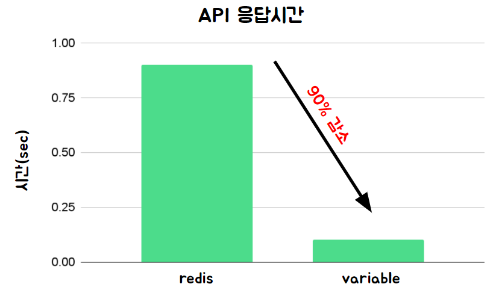

# 삽질록

## NNI vs Ray 주관비교

### NNI

- 하이퍼 파라미터 서칭을 위해 제일 처음 사용한 NNi 입니다.
- 장점
  - 파일형태로 서칭에 필요한 config.yaml과 search_space.json 파일을 작성하기때문에 쉽습니다.
  - 별다른 작업없이도 자동적으로 dashboard를 제공합니다.
- 단점 (장점이었던 부분들이 단점이 되었습니다.)
  - python code로만 관리되었으면 하는데 불필요한 파일작성이 필요했습니다.
  - webui를 실험 실행때 자동으로 띄우는데 이를 배제하는 옵션이 존재하지 않았습니다.

 
 

### NNI

- 하이퍼 파라미터 서칭을 위해 제일 처음 사용한 NNi 입니다.
- 장점
  - 파일형태로 서칭에 필요한 config.yaml과 search_space.json 파일을 작성하기때문에 쉽습니다.
  - 별다른 작업없이도 자동적으로 dashboard를 제공합니다.
- 단점 (장점이었던 부분들이 단점이 되었습니다.)
  - python code로만 관리되었으면 하는데 불필요한 파일작성이 필요했습니다.
  - webui를 실험 실행때 자동으로 띄우는데 이를 배제하는 옵션이 존재하지 않았습니다.

 
 

## 우리는 왜 Redis를 버렸나

- 상당히 작은 모델임에도 불구하고 redis에 넣기전 serialize하는 작업과
- redis에서 꺼내서 deserialize하는 작업이 오래 걸립니다.
- 이를 해결하기 위해 메모리에 모델을 그대로 올리고 일정시간이 지나면 지워주는 코드를 사용하게 되었습니다.
